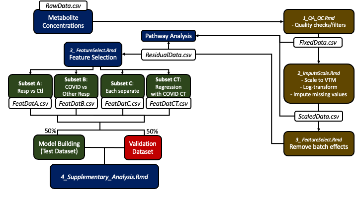

Supplementary Information for "*Small molecule metabolome identifies potential therapeutic targets against COVID-19.*"

Authors:	Sean Bennet, Martin Kaufmann, Calvin Sjaarda, Kaede Takami, Katya Douchant, Emily Moslinger, Henry Wong, D Reed, A Ellis, S Vanner, Robert I. Colautti,#, Prameet M. Sheth


> NOTE: Raw data and fully reproducible code for this project are available on GitHub: http://bit.ly/COVID-Metabolomics

```{r setup, include=FALSE}
knitr::opts_chunk$set(echo = TRUE)
```

# Setup

## Basic setup for plotting and data handling

```{r, message=F, warning=F}
library(tidyverse) # Tools for data science (graphing, data reorganizing, etc.)
library(ropls) 

# Some custom graphing stuff
source("./theme_pub.R")
theme_set(theme_pub())
```

## User-parameters

```{r}
flipResp<-T # If True, reverse main axis scaling for respiratory model
flipCOVID<-T # If True, reverse main axis scaling for COVID model
```

## Load data

```{r}
featDatA<-read.csv("./data/FeatDatA.csv") # Features selected from resDat using Subset A
featDatB<-read.csv("./data/FeatDatB.csv") # Features selected from resDat using Subset B
featDatC<-read.csv("./data/FeatDatC.csv") # Features selected from resDat using Subset C
featDatCT<-read.csv("./data/FeatDatCT.csv") # Features selected from resDat using Subset based on correlation with CT
```

# Project Overview


# Pipeline Details



# PLS-DA - all groups

Full Partial Least Squares Discriminant Analysis with all 4 groups (and 3 orthogonal predictor axes)

NOTE: This is used for graphing purposes only. For predictive models, see OPLS-DA models, below.

```{r}
# RDA Model
# Setup for grid search with Leave-One-Out Cross-Validation (LOOC using the test-building subset of data)
FULLdat<-featDatC %>% # Dataset with new encoding
  filter(Class.name %in% c("Control","COVID19","Influenza","RSV")) %>% # Remove VTM
  column_to_rownames("Sample.Name")

DescNames<-c("Batch.Number","Class.name","Sex","Age","CT","OrigClass") # Response Variable
Concs<-names(FULLdat)[!names(FULLdat) %in% DescNames] # Predictor Variables


# Organize data for opls
metData<-FULLdat[,Concs] # Metabolite data
patClass<-FULLdat[,"Class.name"] # Predictors
# Set row.names
names(patClass)<-row.names(FULLdat) 

# Model of full data for plotting
FULLmod<-opls(metData, patClass, predI=3, fig.pdfC="none")
```

NOTE: No confusion matrix is calculated here (no cross-validation). The purpose is to see whether samples form distinct groups, and factor loadings, rather than to generate and test predictions from the model (that is done below).

## PLS-DA axis plots

```{r}
pDatF<-as.data.frame(FULLmod@scoreMN)
pDatF$Class<-as.factor(FULLdat$Class.name)
pDatF$Age<-as.factor(FULLdat$Age)
pDatF$Sex<-as.factor(FULLdat$Sex)

ggplot(aes(x=p1,y=p2,group=Class,fill=Class,shape=Class),data=pDatF) +
  stat_ellipse(aes(colour=Class),size=1.2, alpha=0.8) +
  geom_point(size=3,alpha=0.8) +
  scale_fill_manual(values=c("#989788","#E54F6D","#008BF8","#623CEA","#E7EBC5")) +
  scale_colour_manual(values=c("#989788","#E54F6D","#008BF8","#623CEA")) +
  scale_shape_manual(values=c(22,21,24,25,22))

ggplot(aes(x=p1,y=p3,group=Class,fill=Class,shape=Class),data=pDatF) +
  stat_ellipse(aes(colour=Class),size=1.2, alpha=0.8) +
  geom_point(size=3,alpha=0.8) +
  scale_fill_manual(values=c("#989788","#E54F6D","#008BF8","#623CEA","#E7EBC5")) +
  scale_colour_manual(values=c("#989788","#E54F6D","#008BF8","#623CEA")) +
  scale_shape_manual(values=c(22,21,24,25,22))

ggplot(aes(x=p2,y=p3,group=Class,fill=Class,shape=Class),data=pDatF) +
  stat_ellipse(aes(colour=Class),size=1.2, alpha=0.8) +
  geom_point(size=3,alpha=0.8) +
  scale_fill_manual(values=c("#989788","#E54F6D","#008BF8","#623CEA","#E7EBC5")) +
  scale_colour_manual(values=c("#989788","#E54F6D","#008BF8","#623CEA")) +
  scale_shape_manual(values=c(22,21,24,25,22))
```

## Export PLD-DA plotting data

```{r}
#write.csv(pDatF,"./pDat/FULLdat.csv")
```

## Graph of loadings:

```{r}
Loadings<-as.data.frame(FULLmod@loadingMN)
Loadings$Metabolite<-row.names(Loadings)
heatDat<-gather(Loadings,Axis,Loading,all_of(names(Loadings[-4])))
heatDat<-as.data.frame(heatDat)

ggplot(aes(x=Axis,y=Metabolite,fill=Loading),data=heatDat) + geom_tile() +
  facet_grid(~ Axis, scales = "free_x", space = "free_x") + 
  scale_fill_gradientn(colours=c("#008BF8","#E7EBC5","#E54F6D"))
```

## Export FULL model loadings data

```{r}
#write.csv(heatDat,"./pDat/FULLload.csv")
```


# OPLS-DA with FS

Orthogonal PLS used here for models based on two bins. NOTE: the x-axis is the orthogonal predictor, a second (y-axis) is added only for plotting purposes.

## Control vs All respiratory

```{r}
# Respiratory Only
RESPdat<-featDatA %>% # Dataset with new encoding
  filter(Class.name %in% c("Control","COVID19","Influenza","RSV")) %>%
  column_to_rownames("Sample.Name")
RESPdat$OrigClass<-RESPdat$Class.name
RESPdat$Class.name<-recode_factor(RESPdat$Class.name, COVID19 = "Resp",
                                   Influenza = "Resp", RSV = "Resp") 

DescNames<-c("Batch.Number","Class.name","Sex","Age","CT","OrigClass") # Response Variable
Concs<-names(RESPdat)[!names(RESPdat) %in% DescNames] # Predictor Variables

# Organize data for opls
metData<-RESPdat[,Concs] # Metabolite data
patClass<-RESPdat[,"Class.name"] # Predictors
# Set row.names
names(patClass)<-row.names(RESPdat) 
# opls model
set.seed(4325)
OPLSMod<-opls(metData, patClass, subset="odd", fig.pdfC="none")
trainSet <- getSubsetVi(OPLSMod)

print("Fitted Model")
table(patClass[trainSet],fitted(OPLSMod))

print("Test Data")
TestFit<-table(patClass[-trainSet],
      predict(OPLSMod, metData[-trainSet, ]))

TestFit

TP<-TestFit[1] # True Positive
FP<-sum(TestFit[2])# False Positive
FN<-sum(TestFit[3]) # False Negative
TN<-sum(TestFit)-TP-FP-FN# True Negative

# Model of full data for plotting
pOPLSMod<-opls(metData, patClass, fig.pdfC="none")
```

### Accuracy

```{r}
(TP+TN)/(sum(TestFit))
```

### Sensitivity

```{r}
(TP)/(TP+FN)
```

### Specificity

```{r}
TN/(TN+FP)
```

### Plot data

NOTE: plot for training data only

```{r}
pDat<-as.data.frame(pOPLSMod@scoreMN)
if(flipResp==T){
  pDat<-pDat*-1
}
pDat$Class<-RESPdat$OrigClass
pDat$Group<-RESPdat$Class.name
pDat$Age<-RESPdat$Age
pDat$Sex<-RESPdat$Sex
names(pDat)<-gsub("p([0-9])","Resp\\1",names(pDat))

#ggplot(aes(x=Full1,y=Full2,group=Class),data=pDat) + 
#  geom_point(aes(colour=Class),size=3,alpha=0.7) + scale_colour_brewer(palette = "Set1") 

#ggplot(aes(x=Full3,y=Full4,group=Class),data=pDat) + 
#  geom_point(aes(colour=Class),size=3,alpha=0.7) + scale_colour_brewer(palette = "Set1") 

#ggplot(aes(x=Full1,y=Full5,group=Class),data=pDat) + 
#  geom_point(aes(colour=Class),size=3,alpha=0.7) + scale_colour_brewer(palette = "Set1") 
```

### Plot Control vs All Resp

```{r}
ggplot(aes(x=Resp1,y=Resp2),data=pDat) +
  stat_ellipse(aes(colour=Group),size=1.2, alpha=0.8) +
  geom_point(aes(fill=Class,shape=Class),size=3,alpha=0.8) +
  scale_fill_manual(values=c("#989788","#E54F6D","#008BF8","#623CEA","#E7EBC5")) +
  scale_colour_manual(values=c("grey65","#E54F6D")) +
  scale_shape_manual(values=c(22,21,24,25,22))
```

### And the same showing age & sex

```{r}
ggplot(aes(x=Resp1,y=Resp2,group=Class),data=pDat) +
geom_point(aes(colour=as.numeric(Age),shape=Sex),size=3,alpha=0.8) +
  scale_colour_gradient(low="blue",high="pink")
```

## Export OPLS data

```{r}
#write.csv(pDat,"./pDat/RESPdat.csv")
```


## COVID vs Other respiratory

```{r}
# Respiratory Only
COVIDdat<-featDatB %>% # Dataset with new encoding
    filter(Class.name %in% c("COVID19","Influenza","RSV")) %>%
    column_to_rownames("Sample.Name")
COVIDdat$OrigClass<-COVIDdat$Class.name
COVIDdat$Class.name<-gsub("Influenza|RSV","Other Resp",COVIDdat$Class.name)

DescNames<-c("Batch.Number","Class.name","Sex","Age","CT","OrigClass") # Response Variable
Concs<-names(COVIDdat)[!names(COVIDdat) %in% DescNames] # Predictor Variables

# Organize data for opls
metData<-COVIDdat[,Concs] # Metabolite data
patClass<-COVIDdat[,"Class.name"] # Predictors
# Set row.names
names(patClass)<-row.names(COVIDdat) 
# opls model
OPLSMod2<-opls(metData, patClass, predI = 2, subset="odd", fig.pdfC="none")
trainSet <- getSubsetVi(OPLSMod2)

print("Fitted Model")
table(patClass[trainSet],fitted(OPLSMod2))

print("Test Data")
TestFit<-table(patClass[-trainSet],
      predict(OPLSMod2, metData[-trainSet, ]))

TestFit

TP<-TestFit[1] # True Positive
FP<-sum(TestFit[2])# False Positive
FN<-sum(TestFit[3]) # False Negative
TN<-sum(TestFit)-TP-FP-FN# True Negative

# Model for plotting full dataset
pOPLSMod2<-opls(metData, patClass,fig.pdfC="none")
```

### Accuracy

```{r}
(TP+TN)/(sum(TestFit))
```

### Sensitivity

```{r}
(TP)/(TP+FN)
```

### Specificity

```{r}
TN/(TN+FP)
```

### Plot COVID vs other Respiratory

NOTE: plot for training data only

```{r}
pDat2<-as.data.frame(pOPLSMod2@scoreMN)
if(flipCOVID==T){
  pDat2<-pDat2*-1
}
pDat2$Class<-COVIDdat$OrigClass
pDat2$Group<-COVIDdat$Class.name
pDat2$Age<-COVIDdat$Age
pDat2$Sex<-COVIDdat$Sex
names(pDat2)<-gsub("p([0-9])","COVID\\1",names(pDat2))

ggplot(aes(x=COVID1,y=COVID2),data=pDat2) + 
  stat_ellipse(aes(colour=Group),size=1.2, alpha=0.8) +
  geom_point(aes(fill=Class,shape=Class),size=3,alpha=0.8) +
  scale_fill_manual(values=c("#E54F6D","#008BF8","#623CEA")) +
  scale_colour_manual(values=c("#E54F6D","grey65")) +
  scale_shape_manual(values=c(21,24,25))
```

### Age & sex

```{r}
ggplot(aes(x=COVID1,y=COVID2,group=Class),data=pDat2) +
geom_point(aes(colour=as.numeric(Age),shape=Sex),size=3,alpha=0.8) +
  scale_colour_gradient(low="blue",high="pink")
```

## Export OPLS data

```{r}
#write.csv(pDat2,"./pDat/COVIDdat.csv")
```

# Loadings 

Loading for both OPLS models 

RESP = Control vs all respiratory
COVID = COVID vs other respiratory

```{r}
Loadings<-as.data.frame(OPLSMod@loadingMN)
names(Loadings)<-gsub("p","Resp",names(Loadings))
if(flipResp==T){
  Loadings<-Loadings*-1
}
cLoadings<-as.data.frame(OPLSMod2@loadingMN)
names(cLoadings)<-gsub("p","COVID",names(cLoadings))
if(flipCOVID==T){
  cLoadings<-cLoadings*-1
}
heatDat<-full_join(rownames_to_column(Loadings), rownames_to_column(cLoadings), by = "rowname") 
heatDat<-gather(heatDat,Axis,Loading,all_of(names(heatDat)[-1]))
names(heatDat)[1]<-"Metabolite"
heatDat<-as.data.frame(heatDat[heatDat$Axis %in% 
                                 c("COVID1","Resp1"), ])

ggplot(aes(x=Axis,y=Metabolite,fill=Loading),data=heatDat) + geom_tile() +
  facet_grid(~ Axis, scales = "free_x", space = "free_x") + 
  scale_fill_gradientn(colours=c("#008BF8","#E7EBC5","#E54F6D"))
```

## Export OPLS data

```{r}
#write.csv(heatDat,"./pDat/OPLSload.csv")
```

# Histogram of significant metabolites

```{r, fig.width=6, fig.height=8}
pDat3<-gather(FULLdat,Metabolite,Concentration,
              all_of(c("Succinic.acid","Met.SO","LYSOC18.2","Carnosine","beta.Hydroxybutyric.acid")))
ggplot(aes(x=Concentration,group=Class.name),data=pDat3) + 
  geom_density(aes(fill=Class.name),alpha=0.3) + facet_grid(Metabolite ~ .) +
  scale_fill_manual(values=c("#989788","#E54F6D","#008BF8","#623CEA","#E7EBC5"))
```

## Export Metabolite Data

```{r}
#write.csv(FULLdat,"./pDat/Metabolites.csv")
```


# Other stuff (Exploratory)

# CT Correlations

Do the major metabolites from COVID1 correlate with CT value in COVID and other respiratory patients?

```{r, fig.dim = c(6, 12)}
COVIDmet<-c("Succinic.acid",
           "Carnosine","Met.SO","LYSOC18.2","beta.Hydroxybutyric.acid")
CTdat<-COVIDdat[,c("OrigClass","Sex","Age","CT",COVIDmet)] %>%
  gather(Metab,Conc,all_of(COVIDmet))

ggplot(aes(x=Conc,y=as.numeric(CT)),data=CTdat) +
  geom_smooth(aes(group=OrigClass,colour=OrigClass),se=F,method="lm") +
  geom_point(aes(group=OrigClass,fill=OrigClass,shape=OrigClass),
             size=3,alpha=0.8) +
  scale_fill_manual(values=c("#E54F6D","#008BF8","#623CEA")) +
  scale_colour_manual(values=c("#E54F6D","#008BF8","#623CEA")) +
  scale_shape_manual(values=c(21,24,24)) +
  facet_grid(Metab~.,scales="free")

```

# Statistical tests

```{r}
for(Met in unique(CTdat$Metab)){
  for(Cls in unique(CTdat$OrigClass)){
    StatDat<-CTdat[CTdat$Metab == Met &
                     CTdat$OrigClass == Cls,]
    print(anova(lm(Conc~as.numeric(CT), data=StatDat)))
    StatDat<-NA
  }
}
```

Stats summary: Influenze has significantly higher CT count overall, but no effect of 


What about COVID1 axis from OPLS-DA model -- does it predict CT values? 


Setup: 

```{r}
COVIDmet<-c("Carnosine","Met.SO","beta.Hydroxybutyric.acid",
            "LYSOC18.2","Succinic.acid")
CTcomp<-COVIDdat[,COVIDmet]

CTcomp$estCOVID1<-rowSums(t(OPLSMod2@loadingMN[,1]*t(CTcomp)))

CTcomp$Sample<-rownames(CTcomp)
CTcomp$CT<-COVIDdat$CT
CTcomp$OrigClass<-COVIDdat$OrigClass
pDat2$Sample<-rownames(pDat2)

if(flipCOVID==T){
  pDat2$COVID1<-pDat2$COVID1*-1
}

pDat3<-full_join(pDat2[,c("Sample","COVID1")],
                       CTcomp[,c("Sample","estCOVID1","OrigClass","CT")],by="Sample")
```

Double-check proper calculation of COVID1 in full dataset

```{r}
qplot(x=estCOVID1,y=COVID1,data=pDat3)
```

Test for CT correlation

```{r}
ggplot(aes(x=estCOVID1,y=as.numeric(CT)),data=pDat3) +
  geom_smooth(aes(group=OrigClass,colour=OrigClass),se=F,method="lm") +
  geom_point(aes(group=OrigClass,fill=OrigClass,shape=OrigClass),
             size=3,alpha=0.8) +
  scale_fill_manual(values=c("#E54F6D","#008BF8","#623CEA")) +
  scale_colour_manual(values=c("#E54F6D","#008BF8","#623CEA")) +
  scale_shape_manual(values=c(21,24,24))
```

NOPE
